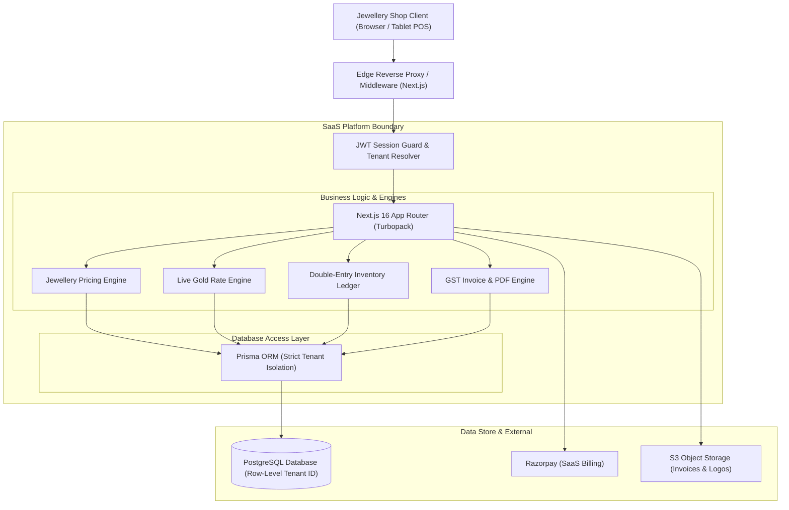
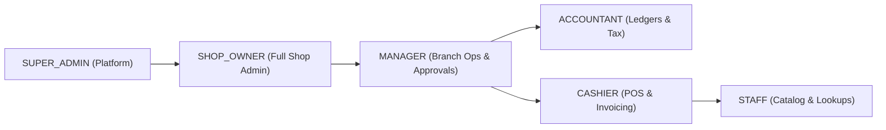
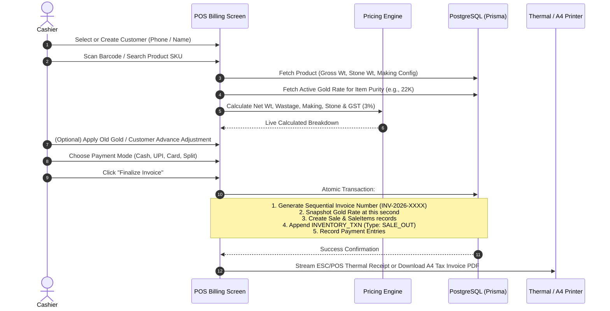
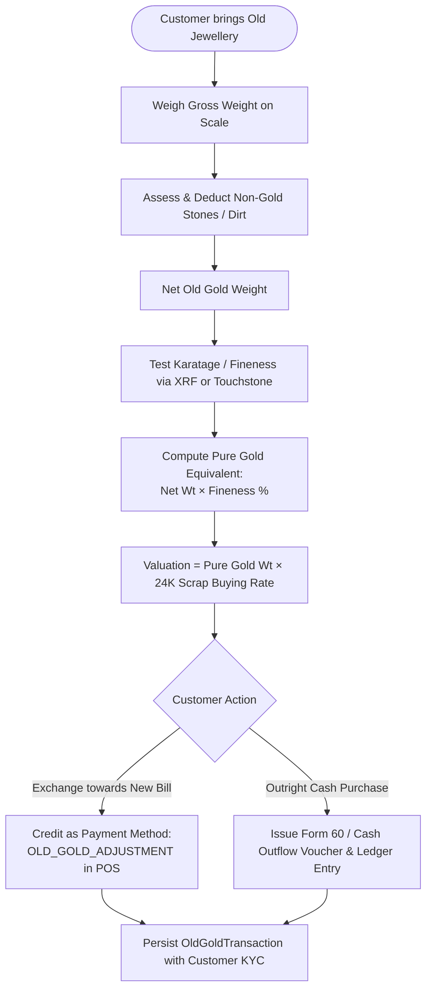
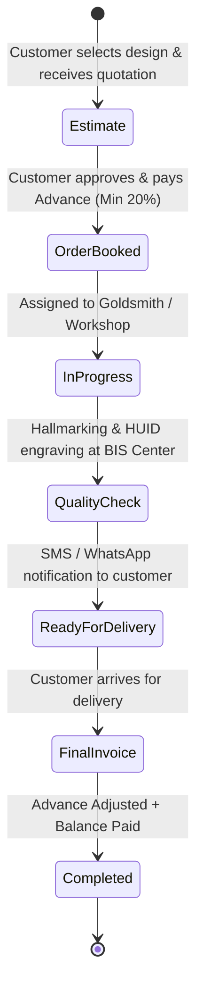
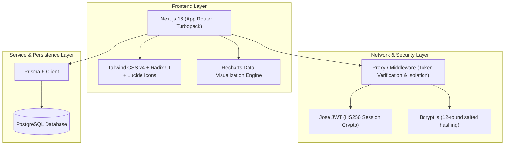
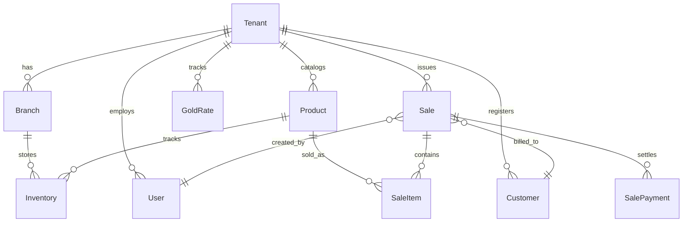
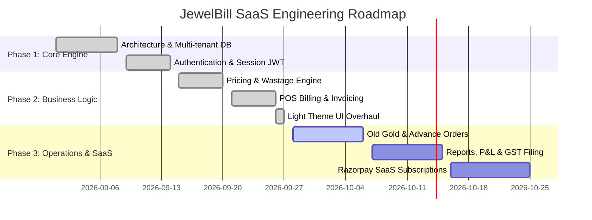

# JewelBill SaaS — End-to-End Architecture, Workflows & UI Design Specification

> [!NOTE]
> This master document serves as the single source of truth for the **JewelBill Gold Jewellery Billing & Inventory SaaS Platform**. It covers end-to-end business workflows, multi-tenant software flow, mathematical pricing models, database schema, and complete UI/UX specifications.

---

## 1. Executive Summary & Product Vision

**JewelBill SaaS** is a high-performance, cloud-native ERP and Point of Sale (POS) system engineered specifically for Indian and international gold, silver, and platinum jewellery retailers. Unlike generic retail software, jewellery retail entails specialized complexities:
- Fluctuating daily metal spot prices (24K, 22K, 18K, 14K, Silver 92.5).
- Multi-dimensional weight computations: **Gross Weight**, **Stone Weight**, **Net Gold Weight**, and **Wastage / Vazhivu**.
- Dual making-charge structures (**per gram**, **percentage**, or **fixed**).
- Statutory compliance: **BIS Hallmark Unique Identification (HUID)**, 3% GST (1.5% CGST + 1.5% SGST), and Income Tax Rule 114B (PAN thresholds).
- Multi-tenant architecture allowing multiple independent retail chains to run isolated instances under a centralized subscription model.

---

## 2. Multi-Tenant SaaS Architecture

Every jewellery retail chain operates as an isolated **Tenant**. Strict tenant isolation is guaranteed at the database, query, and session layers.



### Multi-Tenancy Principles
1. **Tenant Isolation:** Every operational table (`Product`, `Sale`, `Customer`, `Inventory`, `GoldRate`) includes a mandatory `tenantId`.
2. **Context Derivation:** The `tenantId` is decrypted from the encrypted HTTP-only JWT cookie (`jewelbill_session`) on the server. The client is never allowed to pass or override its own `tenantId`.
3. **Cross-Tenant Guard:** The `assertTenantAccess(session, resourceTenantId)` utility verifies that no user can mutate or view another tenant's records.

---

## 3. User Roles & Permission Matrix (RBAC)

JewelBill implements hierarchical Role-Based Access Control:



| Module / Feature | Super Admin | Shop Owner | Manager | Accountant | Cashier | Staff |
| :--- | :---: | :---: | :---: | :---: | :---: | :---: |
| **SaaS Plans & Tenant Management** | ✅ | ❌ | ❌ | ❌ | ❌ | ❌ |
| **Shop Settings & Branch Setup** | ❌ | ✅ | ❌ | ❌ | ❌ | ❌ |
| **Daily Gold Rate Updates** | ❌ | ✅ | ✅ | ❌ | ❌ | ❌ |
| **New Bill / POS Invoicing** | ❌ | ✅ | ✅ | ❌ | ✅ | ❌ |
| **Discounts Exceeding Limit (>3%)**| ❌ | ✅ | ✅ (OTP) | ❌ | ❌ | ❌ |
| **Sales Return & Cash Refunds** | ❌ | ✅ | ✅ | ❌ | ❌ | ❌ |
| **Old Gold Purchase / Exchange** | ❌ | ✅ | ✅ | ❌ | ✅ | ❌ |
| **Stock Adjustments & Transfers** | ❌ | ✅ | ✅ | ❌ | ❌ | ❌ |
| **Supplier Purchases & Inwarding**| ❌ | ✅ | ✅ | ✅ | ❌ | ❌ |
| **Customer Credit & Ledger View** | ❌ | ✅ | ✅ | ✅ | ✅ | ❌ |
| **Profit & Loss / Tax Reports** | ❌ | ✅ | ❌ | ✅ | ❌ | ❌ |

---

## 4. End-to-End Business Workflows

### 4.1 POS Sales & Invoicing Workflow

The core transaction loop allows a cashier to barcode-scan or search an item, apply dynamic gold rate locks, compute making/wastage charges, deduct customer advances, and generate an immutable GST invoice.



---

### 4.2 Old Gold Exchange & Valuation Flow

Retail customers frequently trade in old gold jewellery to fund new purchases.



---

### 4.3 Custom Order & Advance Collection Flow

For bridal jewellery and bespoke orders that require workshop manufacturing:



---

### 4.4 Double-Entry Inventory Stock Ledger

Stock is **never** updated via a simple mutable counter. Every single gram of precious metal is audited through an immutable `InventoryTransaction` ledger:

```mermaid
graph TD
    subgraph Inflow (+ Stock)
        P[Supplier Purchase IN] --> Ledger
        SR[Customer Sales Return IN] --> Ledger
        ADJ_IN[Physical Audit Adjustment IN] --> Ledger
        TR_IN[Inter-branch Transfer IN] --> Ledger
    end

    Ledger[("Inventory Transaction Ledger<br/>(Recorded by Purity, SKU & Grams)")]

    subgraph Outflow (- Stock)
        Ledger --> S[POS Sale OUT]
        Ledger --> PR[Supplier Purchase Return OUT]
        Ledger --> ADJ_OUT[Audit Scrap / Wastage OUT]
        Ledger --> TR_OUT[Inter-branch Transfer OUT]
    end
```

---

## 5. Mathematical Pricing Engine

The calculation engine is implemented in [`src/lib/pricing.ts`](file:///c:/Users/Sharanraj/Documents/GitHub/Billing-SaaS/billing-saas-app/src/lib/pricing.ts) and has zero external dependencies for pure deterministic unit testing.

### Complete Formula Breakdown

$$\text{Net Gold Weight} = \text{Gross Weight} - \text{Stone Weight}$$

#### Wastage / Vazhivu Computation
$$\text{Wastage Grams} = \begin{cases} 
\text{Wastage Value (fixed grams)} & \text{if Type} = \text{WEIGHT\_GRAMS} \\
\dfrac{\text{Net Gold Weight} \times \text{Wastage Value}}{100} & \text{if Type} = \text{PERCENTAGE}
\end{cases}$$

$$\text{Chargeable Weight} = \text{Net Gold Weight} + \text{Wastage Grams}$$
$$\text{Gold Value} = \text{Chargeable Weight} \times \text{Rate Per Gram}$$

#### Making Charges (Velaikooli)
$$\text{Making Charge} = \begin{cases} 
\text{Net Gold Weight} \times \text{Making Value} & \text{if Type} = \text{PER\_GRAM} \\
\dfrac{\text{Gold Value} \times \text{Making Value}}{100} & \text{if Type} = \text{PERCENTAGE} \\
\text{Making Value} & \text{if Type} = \text{FIXED}
\end{cases}$$

#### Gross & Taxable Amount
$$\text{Gross Item Amount} = \text{Gold Value} + \text{Making Charge} + \text{Stone Charge}$$
$$\text{Taxable Amount} = \text{Gross Item Amount} - \text{Discount Amount}$$

#### Statutory Jewellery GST (3%)
$$\text{CGST (1.5\%)} = \dfrac{\text{Taxable Amount} \times 1.5}{100}$$
$$\text{SGST (1.5\%)} = \dfrac{\text{Taxable Amount} \times 1.5}{100}$$
$$\text{Total Invoice Amount} = \text{Taxable Amount} + \text{CGST} + \text{SGST}$$

---

## 6. Software Architecture & Technical Stack



### Database Schema Highlights ([`prisma/schema.prisma`](file:///c:/Users/Sharanraj/Documents/GitHub/Billing-SaaS/billing-saas-app/prisma/schema.prisma))



---

## 7. UI/UX Design System Specification

### 7.1 Curated Light Theme Palette

To reflect the prestige, purity, and luxury of fine jewellery retail, the application uses an editorial luxury light aesthetic:

| Token | CSS Variable | Hex / Value | Usage |
| :--- | :--- | :--- | :--- |
| **Canvas Background** | `--bg-base` | `#f8fafc` | Clean, airy viewport base background |
| **Surface Card** | `--bg-surface` | `#ffffff` | Pure white for cards, panels, and sidebars |
| **Hover Surface** | `--bg-hover` | `#f1f5f9` | Gentle contrast state on table rows |
| **Border Neutral** | `--border` | `#e2e8f0` | Razor-sharp, subtle divider lines |
| **Border Gold** | `--border-gold` | `rgba(217, 119, 6, 0.35)` | Accent borders on active elements |
| **Prestige Gold Accent**| `--gold-500` | `#d97706` | Primary action buttons and badges |
| **Deep Gold Text** | `--gold-800` | `#92400e` | High-contrast luxury headings and numbers |
| **Text Primary** | `--text-primary`| `#0f172a` | High-contrast slate-900 typography |
| **Text Secondary** | `--text-secondary`| `#475569` | Sub-labels and column metadata |
| **Text Muted** | `--text-muted` | `#94a3b8` | Placeholders and timestamp markers |

### 7.2 Typography System
- **Display Headings & Currency:** `Outfit` (Geometric, wide numbers, luxury feel)
- **Body & Data Tables:** `Plus Jakarta Sans` / `Inter` (Ultra-legible, modern sans-serif)

### 7.3 Screen-by-Screen Layout & User Journey

#### 1. POS Billing Screen (`/billing`)
- **Left Panel (65% width):**
  - **Quick Barcode & HUID Search Bar:** Instant product identification via keyboard emulation or scanner.
  - **Product Result Dropdown:** Shows item preview, stock availability, gross weight, purity badge, and calculated live price.
  - **Dynamic Bill Items Table:** Inline item rows with gross/stone weight, wastage grams, making charges, editable gold rate per item, and item removal.
- **Right Panel (35% width):**
  - **Customer Selector Card:** Search customer by mobile number or add a new walk-in buyer.
  - **Live Bill Summary:** Clear breakdown of Subtotal, Invoice Discount, CGST (1.5%), SGST (1.5%), and Grand Total.
  - **Payment Mode Selector:** Quick grid buttons for Cash, UPI (with QR generation capability), Card, Bank Transfer, and Split Payment.
  - **Finalize Button:** One-click confirmation with sound effect and automatic print trigger.

#### 2. Analytics Dashboard (`/dashboard`)
- **Metric Cards (Top 4 KPIs):** Today's Sales (₹), Gold Sold (Grams), Outstanding Dues (₹), and Stock Valuation (₹ Cr) with daily % change indicators.
- **Weekly Revenue Area Chart:** Dual gradient curves comparing sales vs. supplier purchases over time.
- **Live Metal Rate Tracker:** Mini sparkline chart displaying today's 24K, 22K, and 18K price shifts.
- **Recent Transactions Ledger:** Real-time stream of invoices with status chips and payment badges.
- **Low Stock Urgency Panel:** Automatic warnings for fast-moving items whose inventory has dropped below threshold.

#### 3. Invoices & Billing History (`/invoices`)
- **Filter Bar:** Instant tabs (`All`, `Paid`, `Pending`), date range pickers, and export to CSV.
- **Comprehensive Ledger Table:** Invoice #, Customer details, Item summary, Tax split, Grand total, and Payment badge.
- **Actions:** Quick thermal reprint, A4 PDF download, and audit inspect.

---

## 8. Statutory Compliance & Safety Rules

> [!IMPORTANT]
> Retail gold billing in India is subject to strict statutory requirements:
> 1. **Hallmark Unique Identification (HUID):** Every gold article sold must record a 6-digit alphanumeric HUID stamped by a BIS-certified Assaying & Hallmarking Centre.
> 2. **Rule 114B (PAN Card Requirement):** For cash transactions exceeding ₹2,00,000, customer PAN collection is mandatory. The POS prompts for PAN if total cash exceeds ₹2 Lakhs.
> 3. **HSN Codes:** Jewellery invoices must show HSN 7113 (Articles of jewellery of precious metal).

---

## 9. Implementation Roadmap & Development Phases



---
*Document Version: 1.2 · JewelBill SaaS Architecture Reference · Maintained by Core Engineering*
